# 📘 System Architecture Documentation

## 1. High-Level Architecture
The system follows a **Microservices Architecture** deployed on **Kubernetes (EKS)** with **Istio Service Mesh**. It uses an **Event-Driven** approach via **Apache Kafka** for asynchronous communication.

```mermaid
graph TD
    User[User / Client] -->|HTTPS| ALB[AWS Application Load Balancer]
    ALB -->|Traffic| IGW[Istio Ingress Gateway]
    
    subgraph "Kubernetes Cluster (EKS) - Service Mesh"
        IGW -->|mTLS| Auth[🔐 Auth Service]
        IGW -->|mTLS| UserSvc[👤 User Service]
        IGW -->|mTLS| Feed[📰 Feed Service]
        IGW -->|mTLS| Media[🖼️ Media Service]
        IGW -->|WebSocket| Notif[💬 Notification Service]
        
        Auth --> AuthDB[(Auth DB)]
        Auth --> AuthRedis[(Token Cache)]
        
        UserSvc --> UserDB[(User DB)]
        
        Feed --> FeedDB[(Feed DB)]
        Feed --> FeedRedis[(Feed Cache)]
        Feed --> ES((Elasticsearch))
        
        Notif --> NotifDB[(Notif DB)]
        Notif --> NotifRedis[(User Session Cache)]
        
        Media --> MediaDB[(Media Meta DB)]
        Media --> S3[Amazon S3 / MinIO]
    end
    
    %% Event Backbone
    Auth -.->|auth-events| Kafka{🌊 Apache Kafka}
    UserSvc -.->|user-events| Kafka
    Feed -.->|post-events| Kafka
    
    Kafka -.->|consume| Feed
    Kafka -.->|consume| Notif
```



---

## 2. Microservice Responsibilities & Data Isolation
Each service owns its own database. No shared databases are allowed.


---

## 3. Kafka Event Topology
Events drive the consistency between services. The `Feed Service` and `Notification Service` are heavy consumers.

```mermaid
graph LR
    subgraph Producers
        Auth[Auth Service]
        User[User Service]
        FeedProd[Feed Service]
    end

    subgraph Topics
        T_Auth[topic: auth-events]
        T_User[topic: user-events]
        T_Post[topic: post-events]
        T_Reaction[topic: reaction-events]
    end

    subgraph Consumers
        FeedCons[Feed Service]
        NotifCons[Notification Service]
        Search[Elasticsearch Indexer (Internal)]
    end

    Auth -->|Login/Register| T_Auth
    User -->|Profile Update| T_User
    FeedProd -->|New Post| T_Post
    FeedProd -->|Like/Comment| T_Reaction

    T_User -->|Update Author Info| FeedCons
    T_Post -->|Fan-out to Followers| FeedCons
    T_Reaction -->|Notify Owner| NotifCons
    T_Post -->|Notify Friends| NotifCons
```

---

## 4. Request Flow: Create Post
A typical synchronous + asynchronous flow.


