# 📘 Facebook Clone - Enterprise Microservices Platform

<div align="center">


A production-grade, cloud-native social media platform built with **microservices architecture**, **event-driven design**, and **Kubernetes orchestration**. This project demonstrates enterprise-level software engineering practices including service mesh, event streaming, and containerized deployment.

[Features](#-features) •
[Architecture](#-architecture) •
[Tech Stack](#-technology-stack) •
[Quick Start](#-quick-start) •
[AWS Deployment](#-aws-deployment) •
[Documentation](#-documentation)

</div>

---

## 🌟 Features

### Core Functionality
- ✅ **Authentication & Authorization**
  - OAuth 2.0 integration (Google, Facebook)
  - JWT-based authentication (access + refresh tokens)
  - Role-based access control (RBAC)
  - Secure session management with Redis

- ✅ **User Management**
  - User profiles with customizable information
  - Friend connections and follower system
  - Privacy settings and visibility controls
  - User search and discovery

- ✅ **News Feed**
  - Personalized feed generation
  - Post creation with rich media support
  - Real-time feed updates via Kafka
  - Feed caching and ranking algorithms
  - Elasticsearch-powered search

- ✅ **Media Management**
  - Image and video uploads
  - S3-compatible object storage (MinIO/AWS S3)
  - Thumbnail generation
  - CDN-ready architecture

- ✅ **Real-time Notifications**
  - WebSocket-based push notifications
  - Event-driven notification delivery
  - Notification preferences
  - Email notification support

### Enterprise Features
- 🔒 **Security**: mTLS encryption, Zero-trust architecture, Secret management
- 📊 **Observability**: Distributed tracing, Metrics collection, Centralized logging
- 🚀 **Scalability**: Horizontal pod autoscaling, Load balancing, Database sharding ready
- 🔄 **Resilience**: Circuit breakers, Retry mechanisms, Health checks
- 🌐 **Service Mesh**: Istio for traffic management and security

---

## 🏗️ Architecture

### High-Level Architecture

```mermaid
graph TD
    User[👤 Users] -->|HTTPS| ALB[AWS Application Load Balancer]
    ALB -->|Traffic Distribution| IGW[Istio Ingress Gateway]
    
    subgraph "Kubernetes Cluster - EKS"
        IGW -->|mTLS| Auth[🔐 Auth Service]
        IGW -->|mTLS| UserSvc[👤 User Service]
        IGW -->|mTLS| Feed[📰 Feed Service]
        IGW -->|mTLS| Media[🖼️ Media Service]
        IGW -->|WebSocket| Notif[💬 Notification Service]
        
        Auth -->|JDBC| AuthDB[(PostgreSQL)]
        Auth -->|Cache| AuthRedis[(Redis)]
        
        UserSvc -->|JDBC| UserDB[(PostgreSQL)]
        
        Feed -->|JDBC| FeedDB[(PostgreSQL)]
        Feed -->|Cache| FeedRedis[(Redis)]
        Feed -->|Search| ES[Elasticsearch]
        
        Media -->|Metadata| MediaDB[(PostgreSQL)]
        Media -->|Objects| S3[Amazon S3]
        
        Notif -->|JDBC| NotifDB[(PostgreSQL)]
        Notif -->|Sessions| NotifRedis[(Redis)]
    end
    
    subgraph "Event Backbone"
        Kafka{Apache Kafka}
        Auth -.->|auth-events| Kafka
        UserSvc -.->|user-events| Kafka
        Feed -.->|post-events| Kafka
        Kafka -.->|consume| Feed
        Kafka -.->|consume| Notif
    end
    
    subgraph "Frontend"
        Vue[Vue.js SPA] -->|API Calls| IGW
    end
```



### Microservices Breakdown

| Service | Port | Responsibilities | Database | Tech Stack |
|---------|------|-----------------|----------|------------|
| **Auth Service** | 8080 | OAuth login, JWT issuance, Token validation | PostgreSQL + Redis | Spring Boot, Spring Security, OAuth2 |
| **User Service** | 8081 | User profiles, Friends/followers, Privacy | PostgreSQL | Spring Boot, GraphQL |
| **Feed Service** | 8082 | Post creation, Feed aggregation, Ranking | PostgreSQL + Redis + ES | Spring Boot, GraphQL, Kafka |
| **Notification Service** | 8084 | Real-time push, Email notifications | PostgreSQL + Redis | Spring Boot, WebSocket, Kafka |
| **Media Service** | 8085 | Upload handling, Media metadata | PostgreSQL + MinIO/S3 | Spring Boot, REST |

### Data Flow Example: Creating a Post


---

## 🛠️ Technology Stack

### Frontend
| Technology | Version | Purpose |
|------------|---------|---------|
| **Vue.js** | 3.5+ | Progressive JavaScript framework |
| **Vite** | 7.2+ | Lightning-fast build tool |
| **Pinia** | 3.0+ | State management |
| **Vue Router** | 4.6+ | Client-side routing |
| **Apollo Client** | 3.14+ | GraphQL client |
| **Tailwind CSS** | 3.4+ | Utility-first CSS framework |
| **STOMP.js** | 7.2+ | WebSocket communication |

### Backend
| Technology | Version | Purpose |
|------------|---------|---------|
| **Java** | 17 | Programming language |
| **Spring Boot** | 3.2+ | Application framework |
| **Spring Security** | 6.2+ | Authentication & authorization |
| **Spring GraphQL** | 1.2+ | GraphQL implementation |
| **Apache Kafka** | 7.5 | Event streaming platform |
| **PostgreSQL** | 15 | Relational database |
| **Redis** | 7 | In-memory cache |
| **Elasticsearch** | 8.x | Search engine |
| **MinIO** | Latest | S3-compatible object storage |

### Infrastructure & DevOps
| Technology | Purpose |
|------------|---------|
| **Docker** | Container runtime |
| **Kubernetes** | Container orchestration |
| **Istio** | Service mesh |
| **Terraform** | Infrastructure as Code |
| **Amazon EKS** | Managed Kubernetes service |
| **Amazon ECR** | Container registry |
| **AWS VPC** | Network isolation |
| **Application Load Balancer** | Traffic distribution |
| **GitHub Actions** | CI/CD pipeline |

---

## 🚀 Quick Start

### Prerequisites
- Docker Desktop 4.0+
- Node.js 18+
- Java 17+
- Maven 3.8+
- Git

### Option 1: Docker Compose (Recommended for Development)

```bash
# 1. Clone the repository
git clone https://github.com/NGJIERU/facebook-clone.git
cd facebook-clone

# 2. Start all infrastructure and backend services
docker-compose up -d

# 3. Verify services are running
docker-compose ps

# 4. Install frontend dependencies
cd frontend
npm install

# 5. Start frontend development server
npm run dev

# 6. Access the application
open http://localhost:5173
```

### Option 2: Local Development (Backend Only)

```bash
# Terminal 1: Start infrastructure
docker-compose up -d postgres redis kafka minio

# Terminal 2: Run Auth Service
cd backend/auth-service
mvn spring-boot:run

# Terminal 3: Run User Service
cd backend/user-service
mvn spring-boot:run

# Terminal 4: Run Feed Service
cd backend/feed-service
mvn spring-boot:run

# Terminal 5: Run Media Service
cd backend/media-service
mvn spring-boot:run

# Terminal 6: Run Notification Service
cd backend/notification-service
mvn spring-boot:run

# Terminal 7: Run Frontend
cd frontend
npm run dev
```

### Service Endpoints

| Service | URL | Health Check |
|---------|-----|--------------|
| Frontend | http://localhost:5173 | - |
| Auth Service | http://localhost:8080 | http://localhost:8080/actuator/health |
| User Service | http://localhost:8081 | http://localhost:8081/actuator/health |
| Feed Service | http://localhost:8082 | http://localhost:8082/actuator/health |
| Notification Service | http://localhost:8084 | http://localhost:8084/actuator/health |
| Media Service | http://localhost:8085 | http://localhost:8085/actuator/health |
| MinIO Console | http://localhost:9001 | admin/password |
| PostgreSQL | localhost:5432 | admin/password |
| Redis | localhost:6379 | - |
| Kafka | localhost:9092 | - |

---

## ☁️ AWS Deployment

### Architecture Overview

The application is designed to run on **Amazon EKS (Elastic Kubernetes Service)** with a fully cloud-native architecture.

### Infrastructure Components

#### 1. Network Layer
```
VPC (10.0.0.0/16)
├── Public Subnets (10.0.1.0/24, 10.0.2.0/24)
│   └── Application Load Balancer
├── Private Subnets (10.0.10.0/24, 10.0.11.0/24)
│   ├── EKS Worker Nodes
│   ├── Application Pods
│   └── Service Mesh (Istio)
└── Isolated Subnets (10.0.20.0/24, 10.0.21.0/24)
    ├── RDS (PostgreSQL)
    ├── ElastiCache (Redis)
    └── MSK (Managed Kafka)
```

#### 2. Compute Layer
- **Amazon EKS**: Kubernetes v1.29+
  - **General Node Group**: `t3.medium` (microservices)
  - **Kafka Node Group**: `m5.large` (Kafka brokers)
  - **Infrastructure Node Group**: `t3.small` (Istio, monitoring)
  - **Auto Scaling**: HPA based on CPU/Memory

#### 3. Data Layer

| Service | AWS Service | Configuration |
|---------|-------------|---------------|
| **PostgreSQL** | Amazon RDS | Multi-AZ, db.t3.medium, Automated backups |
| **Redis** | Amazon ElastiCache | Cluster mode, `cache.t3.micro` |
| **Kafka** | Amazon MSK or Self-managed | 3 brokers, `kafka.m5.large` |
| **Object Storage** | Amazon S3 | Versioning enabled, Lifecycle policies |
| **Search** | Amazon OpenSearch | 2 nodes, `t3.small.search` |

#### 4. Security


**Security Features:**
- ✅ WAF with rate limiting and geo-blocking
- ✅ TLS 1.3 encryption on ALB
- ✅ Istio mTLS (STRICT mode) between services
- ✅ Security Groups (least privilege)
- ✅ Network ACLs for subnet isolation
- ✅ AWS Secrets Manager for credentials
- ✅ KMS encryption for data at rest
- ✅ IAM Roles for Service Accounts (IRSA)

#### 5. Observability & Monitoring


### Deployment Process

#### Prerequisites
1. AWS Account with administrative access
2. AWS CLI configured (`aws configure`)
3. Terraform 1.5+
4. kubectl 1.28+
5. Docker for building images

#### Step 1: Infrastructure Provisioning

```bash
cd infrastructure

# Initialize Terraform
terraform init

# Review the plan
terraform plan

# Apply infrastructure
terraform apply

# Note the outputs:
# - EKS cluster name
# - ECR repository URLs
# - VPC ID
# - Load balancer DNS
```

**Resources Created:**
- VPC with public, private, and isolated subnets
- EKS cluster with managed node groups
- ECR repositories for each microservice
- IAM roles and policies
- Security groups

#### Step 2: Container Registry Setup

```bash
# Authenticate Docker to ECR
aws ecr get-login-password --region ap-southeast-1 | \
  docker login --username AWS --password-stdin \
  <account-id>.dkr.ecr.ap-southeast-1.amazonaws.com

# Build and push images
./infrastructure/deploy-images.sh

# This script will:
# 1. Build all Docker images
# 2. Tag with ECR repository URLs
# 3. Push to Amazon ECR
```

#### Step 3: Configure kubectl

```bash
# Update kubeconfig
aws eks update-kubeconfig \
  --region ap-southeast-1 \
  --name facebook-cluster

# Verify connection
kubectl get nodes
kubectl get namespaces
```

#### Step 4: Install Istio Service Mesh

```bash
# Download Istio
curl -L https://istio.io/downloadIstio | sh -
cd istio-1.28.2

# Install Istio
./bin/istioctl install --set profile=production -y

# Enable automatic sidecar injection
kubectl label namespace default istio-injection=enabled

# Verify installation
kubectl get pods -n istio-system
```

#### Step 5: Deploy Secrets

```bash
# Create Kubernetes secrets from AWS Secrets Manager
kubectl create secret generic jwt-secret \
  --from-literal=secret-key=<jwt-secret-key>

kubectl create secret generic database-credentials \
  --from-literal=username=admin \
  --from-literal=password=<secure-password>

kubectl create secret generic minio-credentials \
  --from-literal=access-key=<access-key> \
  --from-literal=secret-key=<secret-key>
```

#### Step 6: Deploy Database Layer

```bash
# Option A: Use Amazon RDS (Recommended)
# RDS instances already created by Terraform
# Update connection strings in deployment YAML files

# Option B: Deploy PostgreSQL on EKS (Development only)
kubectl apply -f infrastructure/k8s/postgres-deployment.yaml
kubectl apply -f infrastructure/k8s/redis-deployment.yaml
```

#### Step 7: Deploy Kafka

```bash
# Option A: Amazon MSK (Recommended)
# MSK cluster provisioned by Terraform
# Update broker endpoints in deployment files

# Option B: Self-managed Kafka on EKS
kubectl apply -f infrastructure/k8s/kafka-deployment.yaml

# Verify Kafka is running
kubectl get pods -l app=kafka
```

#### Step 8: Deploy Microservices

```bash
# Deploy all services
kubectl apply -f infrastructure/k8s/secrets.yaml
kubectl apply -f infrastructure/k8s/auth-deployment.yaml
kubectl apply -f infrastructure/k8s/user-deployment.yaml
kubectl apply -f infrastructure/k8s/feed-deployment.yaml
kubectl apply -f infrastructure/k8s/media-deployment.yaml
kubectl apply -f infrastructure/k8s/notification-deployment.yaml

# Verify deployments
kubectl get deployments
kubectl get pods

# Check service health
kubectl get svc
```

#### Step 9: Configure Istio Gateway

```bash
# Deploy Istio ingress gateway
kubectl apply -f infrastructure/k8s/istio-gateway.yaml

# Get load balancer URL
kubectl get svc istio-ingressgateway -n istio-system

# Note the EXTERNAL-IP - this is your application endpoint
```

#### Step 10: Deploy Frontend

```bash
# Build production frontend
cd frontend
npm run build

# Option A: Deploy to S3 + CloudFront (Recommended)
aws s3 sync dist/ s3://facebook-frontend-bucket/
aws cloudfront create-invalidation --distribution-id <id> --paths "/*"

# Option B: Deploy to EKS
docker build -t frontend:latest .
docker tag frontend:latest <ecr-url>/frontend:latest
docker push <ecr-url>/frontend:latest
kubectl apply -f infrastructure/k8s/frontend-deployment.yaml
```

#### Step 11: DNS Configuration

```bash
# Get ALB DNS name
ALB_DNS=$(kubectl get svc istio-ingressgateway -n istio-system \
  -o jsonpath='{.status.loadBalancer.ingress[0].hostname}')

# Create Route 53 record (or update your DNS provider)
# Point api.yourdomain.com -> ALB DNS (CNAME or ALIAS)
# Point www.yourdomain.com -> CloudFront distribution
```

#### Step 12: Enable Auto Scaling

```bash
# Install metrics server
kubectl apply -f https://github.com/kubernetes-sigs/metrics-server/releases/latest/download/components.yaml

# HPA is already configured in deployment files
# Verify HPA status
kubectl get hpa

# Example HPA output:
# NAME           REFERENCE                 TARGETS   MINPODS   MAXPODS   AGE
# auth-service   Deployment/auth-service   45%/80%   2         10        5m
```

### Cost Estimation (Monthly)

| Component | Service | Configuration | Estimated Cost |
|-----------|---------|---------------|----------------|
| **Compute** | EKS + EC2 | 3x t3.medium nodes | $75 |
| **Database** | RDS PostgreSQL | 5x db.t3.medium Multi-AZ | $250 |
| **Cache** | ElastiCache Redis | 2x cache.t3.micro | $50 |
| **Storage** | S3 Standard | 100 GB + requests | $25 |
| **Load Balancer** | ALB | 1x ALB | $25 |
| **Data Transfer** | Egress | 100 GB/month | $10 |
| **Monitoring** | CloudWatch | Logs + Metrics | $20 |
| **Kafka** | MSK or EC2 | 3x kafka.m5.large | $400 (MSK) / $250 (EC2) |
| **Container Registry** | ECR | 10 GB storage | $1 |
| **Total** | - | - | **~$856 - $1,006/month** |

> 💡 **Cost Optimization Tips:**
> - Use Spot Instances for non-critical workloads (50-70% savings)
> - Enable S3 Intelligent-Tiering
> - Use Aurora Serverless for variable workloads
> - Implement auto-scaling to reduce idle resources
> - Use AWS Cost Explorer and set up billing alarms

### Monitoring & Alerts

```bash
# Install monitoring stack
kubectl apply -f infrastructure/k8s/monitoring/

# Access dashboards
kubectl port-forward -n monitoring svc/grafana 3000:80
kubectl port-forward -n monitoring svc/prometheus 9090:9090
kubectl port-forward -n monitoring svc/jaeger 16686:16686

# View metrics at:
# - Grafana: http://localhost:3000 (admin/admin)
# - Prometheus: http://localhost:9090
# - Jaeger: http://localhost:16686
```

### Disaster Recovery

**Backup Strategy:**
- RDS automated backups (7-day retention)
- S3 versioning enabled
- Kubernetes stateful data backed up daily
- Infrastructure code versioned in Git

**Recovery Procedure:**
```bash
# 1. Restore RDS from snapshot
aws rds restore-db-instance-from-db-snapshot \
  --db-instance-identifier restored-instance \
  --db-snapshot-identifier snapshot-id

# 2. Restore Terraform state
terraform import aws_eks_cluster.main facebook-cluster

# 3. Redeploy services
kubectl apply -f infrastructure/k8s/
```

---

## 📚 Documentation

### Project Documentation
- [SETUP.md](SETUP.md) - Complete setup guide for beginners
- [ARCHITECTURE.md](ARCHITECTURE.md) - Detailed system architecture
- [PROJECT_SPEC.md](PROJECT_SPEC.md) - Technical specifications
- [TIMELINE.md](TIMELINE.md) - Development timeline

### API Documentation

#### GraphQL APIs
- **User Service GraphQL Playground**: http://localhost:8081/graphiql
- **Feed Service GraphQL Playground**: http://localhost:8082/graphiql

#### REST APIs
- **Auth Service Swagger**: http://localhost:8080/swagger-ui.html
- **Media Service Swagger**: http://localhost:8085/swagger-ui.html

### Database Schema

#### Auth Service (auth_db)
```sql
Tables:
- users: User authentication data
- refresh_tokens: JWT refresh tokens
- oauth_connections: OAuth provider links
```

#### User Service (user_db)
```sql
Tables:
- user_profiles: User profile information
- friendships: Friend connections
- privacy_settings: User privacy preferences
```

#### Feed Service (feed_db)
```sql
Tables:
- posts: User posts
- reactions: Likes and reactions
- comments: Post comments
- feed_cache: Cached feed entries
```

#### Media Service (media_db)
```sql
Tables:
- media_metadata: File information
- thumbnails: Generated thumbnails
```

#### Notification Service (notification_db)
```sql
Tables:
- notifications: Notification records
- user_preferences: Notification settings
```

---

## 🧪 Testing

### Unit Tests
```bash
# Run all backend tests
cd backend
mvn test

# Run specific service tests
cd backend/auth-service
mvn test
```

### Integration Tests
```bash
# Start test environment
docker-compose -f docker-compose.test.yml up -d

# Run integration tests
mvn verify
```

### End-to-End Tests
```bash
# Frontend E2E tests
cd frontend
npm run test:e2e
```

### Performance Testing
```bash
# Install k6
brew install k6

# Run load tests
k6 run tests/load-test.js
```

---

## 🤝 Contributing

We welcome contributions! Please follow these steps:

1. Fork the repository
2. Create a feature branch (`git checkout -b feature/amazing-feature`)
3. Commit your changes (`git commit -m 'Add amazing feature'`)
4. Push to the branch (`git push origin feature/amazing-feature`)
5. Open a Pull Request

### Code Style
- **Java**: Google Java Style Guide
- **JavaScript**: ESLint with Airbnb config
- **Terraform**: terraform fmt

### Commit Convention
```
type(scope): subject

feat: new feature
fix: bug fix
docs: documentation
style: formatting
refactor: code restructuring
test: adding tests
chore: maintenance
```

---

## 📄 License

This project is licensed under the MIT License - see the [LICENSE](LICENSE) file for details.

---

## 👥 Authors

- **NG JIE RU** - *Full-Stack Developer & Project Lead* - [GitHub](https://github.com/NGJIERU) | [LinkedIn](https://www.linkedin.com/in/NGJIERU/)
  - Information System student at University of Malaya
  - Computer enthusiast with passion for microservices architecture and cloud technologies
  - 📧 Contact: jieru0901@gmail.com

---

## 🙏 Acknowledgments

- Spring Boot team for the excellent framework
- Vue.js community for the reactive framework
- Istio project for service mesh capabilities
- Confluent for Kafka expertise
- AWS for cloud infrastructure

---

## 📞 Support

- 📧 Email: support@facebook-clone.com
- 💬 Discord: [Join our community](https://discord.gg/facebook-clone)
- 🐛 Issues: [GitHub Issues](https://github.com/NGJIERU/facebook-clone/issues)
- 📖 Wiki: [Project Wiki](https://github.com/NGJIERU/facebook-clone/wiki)

---

## 🗺️ Roadmap

### Q1 2026
- [ ] Complete all microservices
- [ ] Deploy to AWS EKS
- [ ] Implement comprehensive monitoring

### Q2 2026
- [ ] Mobile apps (React Native)
- [ ] Advanced feed ranking with ML
- [ ] Video streaming support

### Q3 2026
- [ ] Multi-region deployment
- [ ] GraphQL Federation
- [ ] Real-time collaborative features

### Q4 2026
- [ ] AI-powered content moderation
- [ ] Advanced analytics dashboard
- [ ] Performance optimizations

---

<div align="center">

**⭐ Star this repository if you find it helpful!**

Made with ❤️ using Spring Boot, Vue.js, and Kubernetes

</div>
